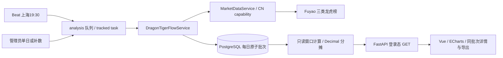

# 龙虎榜资金流向

页面 `/research/dragon-tiger-flow` 是 A 股盘后研究观察，位于研究导航。
它展示龙虎榜样本的概念净额轨迹、概念排行、正负股票贡献及有限游资明细，不参与交易策略、持仓、LLM 或通知。

## 架构



- 领域：`src/finance_analysis/dragon_tiger_flow/`，网络能力注册为 `dragon_tiger_board`，仅支持 CN。
- Provider 独立规范化完整榜单，不读写已有基本面 `dragon_tiger:*` 代码列表缓存。
- Alembic `0064_dragon_tiger_flow` 接续 `0063_portfolio_mutation`。
- `dragon_tiger_flow_batch` 以 `trade_date` 为主键，保存批次 UUID、规则版本、采集开始时间、生成时间与规范化 JSONB。
- JSONB 保存三类来源的可审计金额、概念观测、游资明细、计数、去重数量和错误类型；不是未经筛选的原始响应。
- 日期目录只选择时间、来源状态和错误；窗口查询最多读取20个批次，实际窗口按交易日历计算，缺日不向更早日期借数据。
- 日数据为事实源；5/10/20日派生结果读时计算，不保存重复窗口快照，不增加 Redis 结果缓存。修订某日后所有相关窗口自然更新。

## 上游契约与实测

依据 [扶摇官方文档](https://fuyao.aicubes.cn/llms-full.txt)，调用
`GET /api/a-share/special-data/dragon-tiger-list`，显式传 `date` 与 `board_type=all/org/hot_money`。
密钥仅由服务端现有 `FUYAO_API_KEY` 配置读取。

2026-09-22 使用生产配置中的 key 做了只读验证：2026-09-15、16、17、18、21，三类榜单共15次请求。
通过 `MarketDataService` → Provider → 规范化 → 窗口计算 → 公共 schema 完整路径验证，未连接或写入生产数据库。
五日全部榜1日口径覆盖165只股票、210个概念；三类视图的1日累计与截止日3日截面均通过 schema 与金额守恒检查。
此验证不代表全历史数据质量保证，也没有将真实数据加入测试 fixture。

需要区分：

- 机构榜 `net_value` 是股票整体净额，机构视图使用 `org_net_value`。
- 游资股票级汇总使用全部榜的 `hot_money_net_value`，每个股票/周期只计一次。
- 游资榜 `hot_money_items[].rows` 是有限已命名游资样本，其条数不等于顶层 `count`。
  `hot_money_item_net_value` 只展示该游资明细，不能重复汇总每条记录上的股票级游资总额。
- 机构/游资榜单中 `buy_value/sell_value` 仍是股票整体买卖额，分类视图的买卖额返回 null。
- 机构与游资不能验证为互斥全集，所以独立展示，**不计算“其他＝全部－机构－游资”**。
- `timestamp` 是来源交易日时间戳，不是盘后发布时间；采集/生成时间独立记录。
- API 只支持一年内数据采集；本地已保存的更早结果仍可查询。概念为历史日期响应的观测值，不宣称为官方历史成员档案。

## 计算与缺失

1. 默认20交易日，支持5/10/20；只把 `range_days=1` 纳入累计。
2. 3日榜只展示截止日独立截面，不将重叠3日榜相加。
3. 股票键为 `(symbol, range_days)`；游资明细键为 `(游资名称, symbol, range_days)`。
   同键同值去重，同键冲突拒绝该来源；股票榜核对原始数量及去重股票数量。
4. 金额统一规范化到分（Decimal，半偶舍入）；概念名称 NFKC、去空白、去重并排序。
   分摊按整数分等分，余分按排序分配，正负金额均严格守恒；无概念归入“未分类”。
   对外 JSON 金额为元，图表显示亿元。
5. 窗口前置起点为0，首个交易日计入净额，切换窗口重新归零。
6. 成功且记录为空的日期是有效零；未存日期或所选来源缺失是缺口。缺口后的累计为 null，不连接跨缺口曲线；完整区间总额为 null。
7. 字段未披露保持 null。游资视图仅汇总明确披露值的股票，另报 `excluded_undisclosed_count`（股票日记录数），不将其视为全市场游资总额。
8. Top5正净流入概念占比为最大五个正净额之和 / 全部正净额之和，包含未分类。
   分母为0、窗口缺日或任一概念净额未知时为 null。
9. “资金构成”中的机构/游资金额来自当前股票样本对应字段，可能重叠。下方正负贡献路径仅表示概念归因，不表示真实账户间划款。
   Top5之外保留“其余股票”节点，完整列表可独立排序。

## 发布与任务

- `scheduled.dragon_tiger_flow_cn`：周一至周五 **19:30 Asia/Shanghai**，`analysis` 队列。
- 复用任务中心、PostgreSQL TaskRecord 和独立非阻塞 session advisory lock；非交易日或未收盘跳过。
- 全部外部请求在业务写事务之外。短事务使用发布锁，将同日三类来源作为一个批次更新。
- 核心失败不改旧批次；首次辅助来源失败可发布有效核心并标记错误，单日任务最多重试3次、间隔600秒。
- 已有来源不能被一次更差的采集删除；较早开始的采集不能覆盖较新批次。绝不混用前后两次来源拼出一个批次。
- 补数每次最多31个交易日，逐日独立提交；失败日及部分成功在任务结果中列出，不回滚其他成功日。
- 默认不抓全年。管理员页面提供“采集所选收盘日”“补齐最近20交易日”和刷新已存结果。
  补齐从最近已收盘日开始，跳过已完整日期；指定其他长度或强制修订使用 `/run`。

## API

所有 GET 只读 DB，要求现有 Cookie 登录，不读取私人账户数据。`POST /run` 仅管理员。

| 接口 | 说明 |
| --- | --- |
| `GET /api/v1/dragon-tiger-flow/dates` | 日期、生成时间、已存来源与错误 |
| `GET /api/v1/dragon-tiger-flow/overview` | 摘要、概念轨迹、完整股票证据、有限游资明细、质量 |
| `GET /api/v1/dragon-tiger-flow/concepts/{concept_id}` | 概念与股票贡献 |
| `GET /api/v1/dragon-tiger-flow/stocks/{symbol}` | 股票逐日概念分摊与游资明细 |
| `POST /api/v1/dragon-tiger-flow/run` | 返回202与任务ID |

读参数：`end_date`（缺省为最新已存日）、`days=5|10|20`、`board=all|org|hot_money`、`range_days=1|3`。
指定合法交易日无数据时保留缺口，不回退最新；非交易日和未收盘日期返回422。
详情可附 `revision`：批次变更返回409。页面直接从同一概览响应构造详情和导出，避免多请求批次混合。
快速切换筛选时旧响应失效；失败清除旧证据，避免旧数据披上新筛选标签。

运行请求示例（已有管理员会话）：

```json
{"backfill_days":20,"missing_only":true}
```

或指定单日（与 `backfill_days` 互斥）：

```json
{"trade_date":"2026-09-21"}
```

## 验证

```bash
uv run pytest tests/dragon_tiger_flow tests/test_fuyao_provider.py tests/test_celery_schedule.py tests/test_celery_task_structure.py tests/test_task_advisory_lock.py -q
# 仅专用测试库，测试创建随机 schema 并在结束时清理
DRAGON_TIGER_TEST_POSTGRES_URL=<isolated-test-url> uv run pytest tests/dragon_tiger_flow/test_postgres.py -q
uv run ./scripts/ci_gate.sh
cd web
pnpm run build
pnpm run lint
pnpm run test
pnpm exec playwright test e2e/dragon-tiger-flow.spec.ts
```

默认测试离线；真实采样通过独立只读脚本完成，没有在自动测试中读取生产 key。
前端 fixture 为确定性合成数据，只用于测试。
