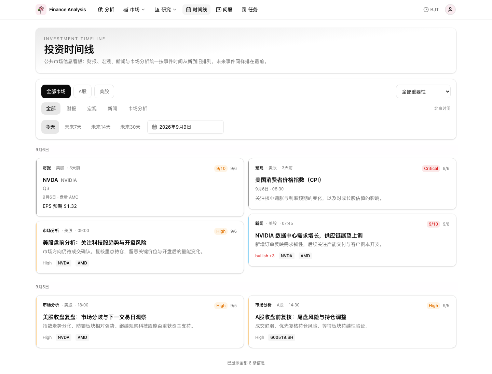
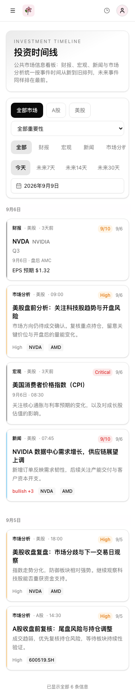

# Investment Timeline / 投资时间线

Investment Timeline 是一个**公共市场信息看板**：所有用户访问 `GET /api/v1/timeline` 看到的内容完全相同。
它聚合财经事件（财报 / 宏观）、逐条新闻分析和公共市场分析报告，没有用户笔记、没有用户隔离、没有
Portfolio / WatchList 私人数据。盘中异动只发送 Notification，任务执行统计仍由 TaskRecord 保存。

## 数据来源

| 来源 | category | 说明 |
| --- | --- | --- |
| `finance_events`（`calendar_type = earnings`） | `event` | 财报日历 |
| `finance_events`（`calendar_type = macro`） | `event` | 宏观事件 |
| `news_analysis` JOIN `news_intel` | `news` | 每条新闻的结构化模型判断 |
| `timeline_entries` | `analysis` | A股收盘前复核、美股盘前分析、美股盘后复盘 |

`timeline_entries` 只承载**公共市场报告**。`manual_note` 已正式下线，相关行在迁移中删除。

## timeline_entries 最终 schema

| 字段 | PostgreSQL 类型 | 约束/语义 |
| --- | --- | --- |
| `id` | INTEGER | 自增主键 |
| `entry_type` | VARCHAR(32) | 必填；`a_share_pre_close` / `us_premarket` / `us_postmarket` |
| `market` | VARCHAR(16) | 可空；CN / US |
| `event_time` | TIMESTAMPTZ | 必填；报告完成时间 |
| `title` | VARCHAR(300) | 必填 |
| `summary` | VARCHAR(500) | 必填；简短业务摘要，不截取完整 Markdown |
| `content` | TEXT | 必填；完整报告 |
| `importance` | VARCHAR(16) | 必填；low / normal / high / critical |
| `actionability` | VARCHAR(24) | 必填；none / watch / consider / action_required |
| `symbol` | VARCHAR(32) | 可空 |
| `related_symbols` | JSONB | 必填；字符串数组，默认 `[]` |
| `source_task` | VARCHAR(128) | 可空；生成任务 |
| `source_run_id` | VARCHAR(64) | 可空；TaskRecord 生命周期的 `task_id` |
| `created_at` / `updated_at` | TIMESTAMPTZ | 必填 |

**不存在 `uid` 列**。CHECK 约束 `ck_timeline_type` 只允许上面三种公共报告类型。

`TimelineEntryRepo` 只有 `create()`；没有 `update_note()` / `delete_note()`，也不接受 `uid`。三个报告任务
（`ASharePreCloseReporter`、`USPostmarketReviewReporter`、`USPremarketAnalysisTaskService`）直接写公共条目，
不再调用 `UserRepository().ensure_default_admin()` 造一个 owner。

## 排序：永远 event_time DESC

Timeline 只有一种顺序：

```sql
ORDER BY event_time DESC, source_type ASC, source_id DESC
```

未来事件（尚未发生的财报、宏观）**不做特殊处理**，时间戳越晚就越靠前。不存在 ASC 模式，也不存在
“未来事件升序、新闻降序”的分支。前端不参与排序，只按 API 返回顺序追加。

Cursor 分页使用同一组排序键：`event_time / source_type / source_id` 的 JSON → base64url token，
后续查询做严格 seek（时间更早，或同时间且来源更大，或同时间同来源且 ID 更小）。取 `limit + 1` 判断
`has_more`。非法 token 返回 422。顶部插入不会推动已加载位置。

## DatePicker：只是截止日期

`end_date` 是 **cutoff**，不是范围起点，也不是“只看某一天”：

```text
event_time < (end_date 当天在展示时区的次日零点)
```

例如展示时区为 `Asia/Shanghai`、`end_date=2026-09-30` 时，`2026-10-01` 的事件被隐藏，`2026-09-30` 及更早
全部保留，向过去继续由 cursor 分页加载。时区边界复用 `core/time.py::day_bounds_utc`，不重复实现。

未提供 `end_date` 时**不设置任何时间上界**：未来 FinanceEvent、最新 News、最新 Analysis 都参与同一条
DESC Timeline。API 没有隐藏的默认日期；Timeline 页面首次进入明确发送展示时区的今天作为 `end_date`。

页面提供今天 / 未来7天 / 未来14天 / 未来30天快捷截止日期。`getTodayInDisplayTimezone()` 获取今天，
已有 `@internationalized/date` 的 `parseDate(...).add({ days })` 按日历天相加，跨月和夏令时无需毫秒运算。
四个 preset 与 DatePicker 共用 `endDate`；trigger 始终展示实际日期，`clearable=false` 禁止清空。
手工选择后 preset 为 `custom`，所有快捷按钮取消选中。切换展示时区时，快捷日期重新计算，custom 日期保留。
这些都是截止日期，不限制历史起点。

## API

- `GET /api/v1/timeline`：`end_date`、`timezone`、`market`、`category`、`calendar_type`、`importance`、`cursor`、`limit`。

`importance` 支持 critical / high / normal / low，省略表示全部。它与市场、类型、截止日期在统一 projection
上组合过滤，不改变来源评分。页面任一查询条件或时区变化都会清空 cursor，重新请求第一页。

不再存在 `date` / `start_date` 范围参数、`/timeline/summary`，以及 `POST|PUT|DELETE /timeline/notes*`。
endpoint 是纯公共查询，不读取 `request.state.uid`，也不依赖 `get_effective_uid`。

统一 item 字段：`id`、`source_type`（`finance_event` / `news` / `report`）、`source_id`、`event_time`、
`category`（`event` / `news` / `analysis`）、`calendar_type`（`earnings` / `macro`，仅财经事件）、`market`、
`title`、`summary`、`symbol`、`related_symbols`、`importance`、`actionability`、`importance_score`、`impact`、
`impact_score`、`event_type`、`detail_type`、`detail_payload`。

财经事件的 `detail_payload` 提供结构化字段：`all_day`、`event_date`、`counter_name`、`market_session`、
`reporting_period`、`currency`、`provider`、`source_providers`、`eps_estimate`、`reported_eps`、
`eps_surprise_pct`、`importance_reason`。`source_providers` 由后端读取合并后的 `raw_payload_json` key 得到，
只有一个来源时退化为 primary provider；前端不解析 raw payload。

## 时间规范

- 报告：`finished_at` → `event_time`。
- 新闻：`published_date`，缺失则 `news_analysis.analyzed_at`。
- 财经事件：`event_datetime`；仅有日期时以市场当地午夜作为排序锚点（US: America/New_York；其他: Asia/Shanghai），
  详情保留原始 `event_date` 和 `all_day`。
- TIMESTAMPTZ 保存绝对时间，DTO 的 `event_time` 统一 UTC，前端按 `Asia/Shanghai` 或 `America/New_York` 展示。

CPI/FOMC、非农和利率决议等核心宏观标题映射为 critical；其他财经事件参考已有 `importance_score`，
未评分事件为 normal。本次没有引入新的评分系统。

## 前端

`/timeline` 页面宽度跟随 Shell 的 `max-w-7xl` 主容器，桌面端明显比旧的 `max-w-3xl` 单列 Feed 宽。

一级 Tab 固定为：

```text
全部 | 财报 | 宏观 | 新闻 | 市场分析
```

映射到后端 filter：财报 = `category=event & calendar_type=earnings`，宏观 = `category=event & calendar_type=macro`，
新闻 = `category=news`，市场分析 = `category=analysis`，全部 = 无 filter。没有“财经事件”一级 Tab，
没有财经事件二级筛选，没有笔记 Tab。

筛选区只有三行元素：市场按钮组、类型 Tab、截止日期 DatePicker；市场按钮与 DatePicker 统一 `h-10`。

每条消息都是独立圆角 Card（`rounded-xl` + border + subtle shadow + hover 抬升 200ms）。四种 Card 共享
`TimelineCardShell.vue` 外壳（类型 · 市场 · 元信息 / 重要度 / 日期），内部布局不同：

- `TimelineEarningsCard.vue`：代码 + 公司名、报告期 · BMO/AMC、日期、EPS 预期 / 实际 / Surprise；字段有值才显示。
- `TimelineMacroCard.vue`：标题 + 日期时间，不套用 symbol / EPS / 报告期。
- `TimelineNewsCard.vue`：标题、摘要、impact 与相关标的。
- `TimelineAnalysisCard.vue`：标题、摘要、重要度。

Card 只负责展示，不自己请求 API；详情继续用现有 `Dialog` + `DialogScrollContent`，财经事件详情由
`TimelineEventDetail.vue` 渲染并在底部显示 `source_providers`。

距离时间（今天 / 明天 / 2天后 / 3天前）只是 UI 信息，不影响排序和 filter。只有后端提供
`trading_days_to_event` 时才显示 `T-x`，否则使用日历天；前端不维护交易日历。

每个日期 group 独立使用 `columns-1 gap-3 lg:columns-2`，1024px 以下一列、以上始终两列（不增为三列）。
Card wrapper 使用 `mb-3 break-inside-avoid`，12px 间距；Shell 为 `block w-full`，自然高度，不拆列。
DOM 仍按 API 顺序单次遍历，未排序、未按奇偶或高度分列，也没有新增第三方依赖。
CSS Columns 按列流动而非逐行左右交替；追加数据或高度变化时浏览器可能重新平衡列，这是已知取舍。

桌面筛选分为市场与重要性、类型、快捷日期与 DatePicker 三行。移动端重要性和 DatePicker 独立换行，
Tab 和快捷日期支持横向滚动；Card 单列，Dialog 可滚动。




## 任务写入矩阵

| 任务 | 长期业务写入 | 执行信息/通知 |
| --- | --- | --- |
| `analysis_a_share_pre_close_review` | timeline_entries：a_share_pre_close，CN，high/consider | TaskRecord + 原聚合通知 |
| `analysis_us_premarket` | timeline_entries：us_premarket，US，high/consider | TaskRecord + 原分析流程通知 |
| `analysis_us_postmarket_review` | timeline_entries：us_postmarket，US，high/watch | TaskRecord + 原报告通知 |
| A股/美股盘中 | 不保存盘中业务结果 | TaskRecord + Notification |
| 财经同步/重要度任务 | finance_events | TaskRecord；同步摘要不进入 Timeline |
| `analysis_us_premarket_news` | news_intel + usage + news_analysis | TaskRecord 统计 + Top 新闻通知 |
| `analysis_daily` | 不新增 Timeline 报告 | 执行摘要只进 TaskRecord |

## 迁移

- `0043_investment_timeline`：建表（历史）。
- `0047_public_timeline`：`DELETE FROM timeline_entries WHERE entry_type = 'manual_note'` →
  `DROP CONSTRAINT ck_timeline_type` → 重建不含 `manual_note` 的约束 → `DROP COLUMN uid`。

迁移是确定性的、幂等的（表不存在或 `uid` 已删除时安全跳过），保留 `a_share_pre_close` /
`us_premarket` / `us_postmarket` 全部历史报告。破坏性迁移不提供伪恢复 downgrade；回滚须恢复迁移前备份。

## 验证

```bash
env -u LLM_MODEL -u LLM_API_KEY -u LLM_BASE_URL uv run ./scripts/ci_gate.sh
cd web && pnpm run build && pnpm run lint && pnpm run test
```

关键覆盖：Timeline 全链路无 uid / note 的源码断言；`manual_note` 被数据库约束拒绝；notes 路由与
summary 路由返回 404；五个 Tab 全部 DESC（含未来事件）；cutoff 过滤 + 时区边界；无 cutoff 时保留未来消息；
cutoff 与 cursor 联合分页无重复无遗漏；PostgreSQL 迁移删除笔记与 uid 并保留公共报告； <!-- pragma: allowlist secret -->
前端 Tab 结构、Tab → filter 映射、DatePicker → `end_date`、四类圆角 Card 与财报详情 provider。
