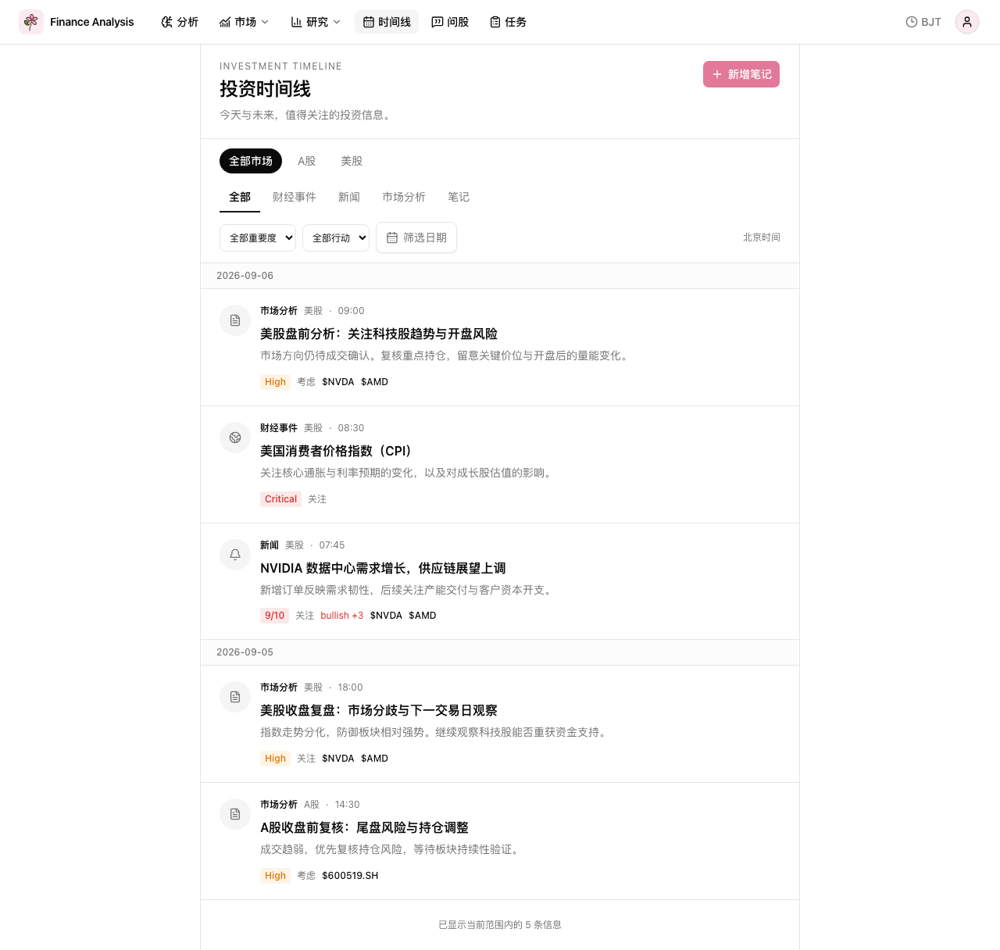
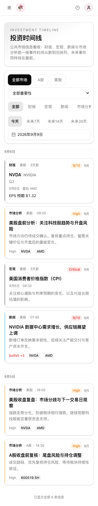

# Investment Timeline / 投资时间线

Investment Timeline 是一个**公共市场信息看板**：所有用户访问 `GET /api/v1/timeline` 看到的内容完全相同。
它聚合财经事件（财报 / 宏观）和逐条新闻分析，没有用户笔记、没有用户隔离、没有
Portfolio / WatchList 私人数据。盘中异动只发送 Notification，任务执行统计仍由 TaskRecord 保存。

## 数据来源

| 来源 | category | 说明 |
| --- | --- | --- |
| `finance_events`（`calendar_type = earnings`） | `event` | 财报日历 |
| `finance_events`（`calendar_type = macro`） | `event` | 宏观事件 |
| `news_analysis` JOIN `news_intel` | `news` | 每条新闻的结构化模型判断 |

市场报告已迁入 [消息中心](notifications.md)。`timeline_entries` 表保留但不再读写；`0049_notification_center` 清空全部旧行，不迁入 notification。TimelineEntryRepo 已删除。

## 排序：永远 event_time DESC

Timeline 只有一种顺序：

```sql
ORDER BY event_time DESC, source_type ASC, source_id DESC
```

未来事件（尚未发生的财报、宏观）**不做特殊处理**，时间戳越晚就越靠前。不存在 ASC 模式，也不存在
“未来事件升序、新闻降序”的分支。前端不参与排序，只按 API 返回顺序追加。

Cursor 分页使用同一组排序键：`event_time / source_type / source_id` 的 JSON → base64url token，
后续查询做严格 seek（时间更早，或同时间且来源更大，或同时间同来源且 ID 更小）。取 `limit + 1` 判断
`has_more`。非法 token 返回 422。顶部插入不会推动已加载位置。

## DatePicker：只是截止日期

`end_date` 是 **cutoff**，不是范围起点，也不是“只看某一天”：

```text
event_time < (end_date 当天在展示时区的次日零点)
```

例如展示时区为 `Asia/Shanghai`、`end_date=2026-09-30` 时，`2026-10-01` 的事件被隐藏，`2026-09-30` 及更早
全部保留，向过去继续由 cursor 分页加载。时区边界复用 `core/time.py::day_bounds_utc`，不重复实现。

未提供 `end_date` 时**不设置任何时间上界**：未来 FinanceEvent、最新 News、最新 Analysis 都参与同一条
DESC Timeline。API 没有隐藏的默认日期；Timeline 页面首次进入明确发送展示时区的今天作为 `end_date`。

页面提供今天 / 未来7天 / 未来14天 / 未来30天快捷截止日期。`getTodayInDisplayTimezone()` 获取今天，
已有 `@internationalized/date` 的 `parseDate(...).add({ days })` 按日历天相加，跨月和夏令时无需毫秒运算。
四个 preset 与 DatePicker 共用 `endDate`；trigger 始终展示实际日期，`clearable=false` 禁止清空。
手工选择后 preset 为 `custom`，所有快捷按钮取消选中。切换展示时区时，快捷日期重新计算，custom 日期保留。
这些都是截止日期，不限制历史起点。

## API

- `GET /api/v1/timeline`：`end_date`、`timezone`、`market`、`category`、`calendar_type`、`importance`、`cursor`、`limit`。

`importance` 指定最低等级，按 low < normal < high < critical 包含所选等级及以上，省略表示全部。
例如 high 同时返回 high 和 critical。它与市场、类型、截止日期在统一 projection
上组合过滤，不改变来源评分。页面任一查询条件或时区变化都会清空 cursor，重新请求第一页。

不再存在 `date` / `start_date` 范围参数、`/timeline/summary`，以及 `POST|PUT|DELETE /timeline/notes*`。
endpoint 是纯公共查询，不读取 `request.state.uid`，也不依赖 `get_effective_uid`。

统一 item 字段：`id`、`source_type`（`finance_event` / `news`）、`source_id`、`event_time`、
`category`（`event` / `news` / `analysis`）、`calendar_type`（`earnings` / `macro`，仅财经事件）、`market`、
`title`、`summary`、`symbol`、`related_symbols`、`importance`、`actionability`、`importance_score`、`impact`、
`impact_score`、`event_type`、`detail_type`、`detail_payload`。

财经事件的 `detail_payload` 提供结构化字段：`all_day`、`event_date`、`counter_name`、`market_session`、
`reporting_period`、`currency`、`provider`、`source_providers`、`eps_estimate`、`reported_eps`、
`eps_surprise_pct`、`importance_reason`。`source_providers` 由后端读取合并后的 `raw_payload_json` key 得到，
只有一个来源时退化为 primary provider；前端不解析 raw payload。

## 时间规范

- 报告：`finished_at` → `event_time`。
- 新闻：`published_date`，缺失则 `news_analysis.analyzed_at`。
- 财经事件：`event_datetime`；仅有日期时以市场当地午夜作为排序锚点（US: America/New_York；其他: Asia/Shanghai），
  详情保留原始 `event_date` 和 `all_day`。
- TIMESTAMPTZ 保存绝对时间，DTO 的 `event_time` 统一 UTC，前端按 `Asia/Shanghai` 或 `America/New_York` 展示。

CPI/FOMC、非农和利率决议等核心宏观标题映射为 critical；其他财经事件参考已有 `importance_score`，
未评分事件为 normal。本次没有引入新的评分系统。

## 前端

`/timeline` 页面宽度跟随 Shell 的 `max-w-7xl` 主容器，桌面端明显比旧的 `max-w-3xl` 单列 Feed 宽。

一级 Tab 固定为：

```text
全部 | 财报 | 宏观 | 新闻
```

映射到后端 filter：财报 = `category=event & calendar_type=earnings`，宏观 = `category=event & calendar_type=macro`，
新闻 = `category=news`，全部 = 无 filter。旧 `category=analysis` 查询返回空集。没有“财经事件”一级 Tab，
没有财经事件二级筛选，没有笔记 Tab。

筛选区只有三行元素：市场按钮组、类型 Tab、截止日期 DatePicker；市场按钮与 DatePicker 统一 `h-10`。

每条消息都是独立圆角 Card（`rounded-xl` + 克制 border + 轻微 hover）。四种 Card 共享
`TimelineCardShell.vue` 外壳（弱化的类型 / 市场 / 元信息 / 重要度 / 日期），内部布局不同：

- `TimelineEarningsCard.vue`：代码、公司名、报告期 · BMO/AMC、日期、EPS 预期 / 实际 / Surprise；字段有值才显示。
- `TimelineMacroCard.vue`：标题 + 日期时间 + 摘要，不套用 symbol / EPS / 报告期。
- `TimelineNewsCard.vue`：标题、摘要（`line-clamp-4`）、impact 与相关标的。
- `TimelineAnalysisCard.vue`：标题、摘要（`line-clamp-5`）、相关标的。

Card 只负责展示，不自己请求 API；详情继续用现有 `Dialog` + `DialogScrollContent`，财经事件详情由
`TimelineEventDetail.vue` 渲染并在底部显示 `source_providers`。

距离时间（今天 / 明天 / 2天后 / 3天前）只是 UI 信息，不影响排序和 filter。只有后端提供
`trading_days_to_event` 时才显示 `T-x`，否则使用日历天；前端不维护交易日历。

每个日期 group 独立使用 `columns-3 gap-3 2xl:columns-4`：普通桌面 3 列，视口 ≥1536px 时 4 列。
Card wrapper 使用 `mb-3 break-inside-avoid`，12px 间距；Shell 为 `block w-full`，高度由内容自然撑开，不强制等高、不拆列。
DOM 仍按 API 顺序单次遍历，未排序、未按奇偶或高度分列，也没有新增第三方依赖。
CSS Columns 按列流动而非逐行左右交替；追加数据或高度变化时浏览器可能重新平衡列，这是已知取舍。

桌面筛选分为市场与重要性、类型、快捷日期与 DatePicker 三行。详情继续用可滚动 Dialog。




## 任务写入矩阵

| 任务 | 长期业务写入 | 执行信息/通知 |
| --- | --- | --- |
| `analysis_a_share_pre_close_review` | notification | TaskRecord + 原聚合通知 |
| `analysis_us_premarket` | notification | TaskRecord + 原分析流程通知 |
| `analysis_us_postmarket_review` | notification | TaskRecord + 原报告通知 |
| `trade_engine_cn` / `trade_engine_us` | notification | 仅确认后的 TradeSignal |
| 财经同步/重要度任务 | finance_events | TaskRecord；同步摘要不进入 Timeline |
| `analysis_us_premarket_news` | news_intel + usage + news_analysis | TaskRecord 统计 + Top 新闻通知 |
| `analysis_daily` | notification | 执行统计只进 TaskRecord |

## 迁移

- `0043_investment_timeline`：建表（历史）。
- `0047_public_timeline`：`DELETE FROM timeline_entries WHERE entry_type = 'manual_note'` →
  `DROP CONSTRAINT ck_timeline_type` → 重建不含 `manual_note` 的约束 → `DROP COLUMN uid`。

迁移是确定性的、幂等的（表不存在或 `uid` 已删除时安全跳过），保留 `a_share_pre_close` /
`us_premarket` / `us_postmarket` 全部历史报告。破坏性迁移不提供伪恢复 downgrade；回滚须恢复迁移前备份。

## 验证

```bash
env -u LLM_MODEL -u LLM_API_KEY -u LLM_BASE_URL uv run ./scripts/ci_gate.sh
cd web && pnpm run build && pnpm run lint && pnpm run test
```

关键覆盖：Timeline 全链路无 uid / note 的源码断言；`manual_note` 被数据库约束拒绝；notes 路由与
summary 路由返回 404；五个 Tab 全部 DESC（含未来事件）；cutoff 过滤 + 时区边界；无 cutoff 时保留未来消息；
cutoff 与 cursor 联合分页无重复无遗漏；PostgreSQL 迁移删除笔记与 uid 并保留公共报告； <!-- pragma: allowlist secret -->
前端 Tab 结构、Tab → filter 映射、DatePicker → `end_date`、四类圆角 Card 与财报详情 provider。

## 新闻数据边界

系统不维护通用互联网搜索；仅下文财报专用研究允许通过 LLMClient 搜索。其他模块不通过 LLM 或外部 Agent 自动补齐信息。
Longbridge Content API 是唯一的外部新闻消息源，其他 Provider 只用于行情、基本面或财经事件。

- 个股分析使用已有行情、技术、基本面。风险判断必须有输入依据；
  业绩信息缺失时直接说明，不生成无来源的新闻摘要、利好催化或分析师评级。
- 大盘复盘仅使用行情、市场宽度、板块和内部结构化数据；数据缺失直接说明，仍可生成报告。
- 美股收盘复盘只读取已持久化的新闻，空列表是正常状态，不阻断 LLM、报告或通知。
- 美股收盘复盘日线经 `MarketDataService` 使用 `db_latest`：DB 缺少目标日时临时请求 Provider，
  DB 缺少前一交易日时也回退整段远程历史。远程数据仅用于本次计算，不写入 DB 或同步 Universe。
  目标日或前一交易日仍不可用的证券标为缺失，不以旧日期行情生成目标日涨跌幅。
- Longbridge 新闻由美股盘前新闻任务直接调用。
  盘前任务持久化原文与使用关联，再写逐条结构化判断。
- `NewsIntel` 保存原始新闻，`NewsIntelUsage` 保存使用关联，`NewsAnalysis` 保存逐条分析。
  Timeline 读取新闻及逐条分析；美股盘前、收盘和历史关联查询继续使用新闻存储。
- 新闻入库接收 `database.news.NewsItem` 列表和来源，保留 URL 去重与观察时间语义。
  历史分析仅按真实 query_id 关联读取新闻，不再按附近时间推测关联；已有历史数据无需迁移。

## 美股财报前瞻与首日预测

`earnings_outlook/` 是财报专用研究模块，是上述禁止通用互联网研究规则的明确例外。
其他模块的信息输入边界不变。不产生 TradeSignal，不修改持仓/现金，不发送消息。
宏观和 A 股继续原有同步及重要性评分；重要性分数不参与两类预测置信度。

### 覆盖、任务与成本

- 财经日历美股同步使用 `UniverseResolver.resolve_universe("us_sp500")` 与
  `resolve_universe("us_nasdaq100")` 当前有效 STOCK 成员并集，按 Instrument ID 去重。
  任一成员列表空或失败会记录异常，不扩展到其他 Universe、自选股或 ETF，不另设市值阈值。
- 日历保持今天到未来30天。每天纽约07:00同步完成后投递 `analysis.earnings_outlook`
  （analysis 队列），为首次入库尚无成功预测的未来事件生成初版；随后只在财报前7个日历天内每日刷新。
  日历不等待研究，重要性任务独立；没有事件字段变化也会重新采集最新价格/市场输入。
- `scheduled.earnings_outlook_final` 每个美股交易日纽约16:10扫描**下一交易日**财报，BMO优先，再AMC。
  当前日AMC依靠前一交易日最终刷新和当天日常研究，16:10不再做当天AMC事前预测。
  周末/节假日用项目XNYS交易日历；缺少真实日历时失败关闭，不能以自然日代替。
- `scheduled.earnings_outlook_review` 每天纽约23:30复盘。正常交易日收盘（含提前收盘）后才读取目标日DB日线。
  未取得同季度同口径实际数据时保持pending，不推算实际营收或EPS。
- `POST /api/v1/timeline/earnings/{event_id}/outlook/refresh` 为管理员异步手工刷新，返回task_id。
  同事件使用非阻塞 PostgreSQL session advisory lock；多个worker共享默认2个研究槽位，可配置1–8。
  槽位或事件锁忙时按原event_id/阶段60秒内延后投递，跨日不重新扫描下一日；消息在发布截止时间过期，
  执行及保存仍重新检查截止时间，避免最终刷新被静默丢弃。
  网络调用期间没有DB写事务；失败记录状态/原因，原成功版本和展示指针保留。
- 研究TTL默认24h，key含Instrument、event_id、季度、事件日程、结构化预期/指引和prompt版本。
  价格变化不强制研究；资料过期、已知预期/指引或日程变化会失效。同一纽约日期、阶段、研究输入已完成则跳过；
  daily/final/manual阶段独立，最终刷新重新取价格和公共市场快照。相同阶段input_hash有数据库唯一约束。
  公共SPY/QQQ和既有板块ETF走势、市场结构、宏观日历按批次复用。

配置见 `.env.example` 的 `EARNINGS_OUTLOOK_*`。没有新增必需付费服务。
技术上下文最多30个完整交易日，包括OHLCV、区间涨幅、收益波动、ATR14；历史财报最多4季，是事件样本。
证券到行业基准没有可靠映射时明确缺失，提供公共板块ETF表现。分析师修正、期权覆盖范围、历史财报价格反应
仅使用已有结构化资料，不为缺项引入采集系统。报价时间用于判断会话，缺失时间的价格不作预测参考。

### 两阶段与搜索证据

1. `earnings_research`：逐个事件研究，查询必须含公司名、代码、季度及财报词。
   输入只保留事件身份、公司、截止时间、预期、指引、分析师修正与历史财报；不携带股价、原始K线或大盘行情。
   第二阶段 `earnings_outlook` 仍使用完整冻结上下文判断价格反应，不减少批次事件数或改变研究并发。
   通常只用近30天资料，最近一季官方指引可更早。保存来源、发布时间、检索时间、事实引用及冲突采用理由。
   一致预期与个别分析师观点分开，不平均混合季度/单位/GAAP口径。
2. `earnings_outlook`：不搜索，输入冻结的context和research bundle，分别判断经营表现与价格反应。
   EPS/营收不能根据大盘和涨幅推断。可以beat且下跌，也可以meet但强指引上涨。

传输层保存 requested、configured_support、status、citations、tool_events。
`confirmed`只表示传输层确认搜索执行，不意味着每个事实都已验证；`unverified`是请求但未确认，
`unavailable`是未配置/不支持。模型自行写出的sources不算执行证据；没有确认的外部事实不作为新增可信输入，
但高质量既有结构化资料仍可用于受限分析。渠道及版本核验见[LLM文档](llm.md#财报专用搜索)。

来源发布晚于研究开始的data_cutoff时排除；日期不明的资料明确标记，相关预测不能高置信度。
可信官方资料已经报告目标季度时冻结。有reported_eps（包括0）或提供方原始实际营收/EPS时直接冻结。
AMC最迟在当天正常收盘冻结；BMO有明确时间时取该时间与开盘的较早值，无明确时间时在事件日纽约零点冻结。
会话未知也在纽约零点冻结。网络调用结束保存前再次检查发布时间和事件日程，过期结果不写成事前成功预测。

### 比较口径与价格

EPS与营收分别比较分析时点的一致预期，保存季度、币种、单位、来源、时间；EPS另要求gaap/adjusted。
读取日历EPS以及Longbridge原始details中的营收预期/实际值。提供方缺失的季度、币种、EPS口径和预期时间保持null，
不把`last_seen_at`或来源检索时间当作一致预期更新时间；不可比较时unknown。
明确的结构化输入或有效research可补齐。日历缺季度时，只接受有日期官方IR来源明确绑定公司代码、
本次发布日期及财季；保存到研究与冻结输入，不按发布日期猜季度，不改原始日历身份/版本哈希。
历史实际数据同样要求季度/币种/单位/口径一致；后续提供方补全已确认的同一季度不使预测失效。
复盘缺同口径实际值时，复用LLM CLI/API搜索独立核验公司官方IR/SEC已公布财报，必须有搜索执行证据、
有日期且匹配公司及财季的官方来源。只换算明确的营收单位，不推断EPS口径、不换汇。
实际补证只写actual，不改预测；每事件/版本每纽约日最多一次，发布后7天内尝试，超期保留pending及原因。
已取得的实际值及证据复用，失败也记日期，避免等待首日日线期间重复付费。

- EPS meet容差：`max(abs(预期)*2%, 0.01 USD)`；非USD不强套美元绝对值。负EPS仍用绝对值算容差，数值越高越好。
- 营收meet容差：`abs(预期)*1%`。上述值可配置，预测和复盘共享函数，快照保留当时配置。
- 置信度为模型证据评分，非胜率：0–3资料不足/冲突，4–6有依据但不确定，7较充分，8–10证据新鲜且互相支持。
  两类分数与理由独立。预期缺失/过期限制财报评分；价格不可用则只保留财报判断。会话暂定或关键资料不确定限制走势评分。
- BMO目标为发布日正常交易日；AMC为下一个正常交易日；会话未知暂按下一交易日并显示provisional及假设。
- 预测含reference_price/time/session、expected_close、intraday_low/high。涨跌幅由代码计算。
  方向up/down采用相对参考价超过±1%，否则flat；价格无效则uncertain。该阈值也用于复盘。
- 区间必须`0 < low <= close <= high`，错误只降级价格部分，不影响财经事件。乐观/基准/悲观情景不编造概率。
  区间不包含夜盘，不是保证或有指定覆盖率的统计置信区间。

### 存储、查询与展示

`0069_earnings_outlook`新增3表：`earnings_research`（资料/传输证据）、`earnings_prediction`
（不可变成功预测、完整输入及模型元数据）、`earnings_outlook_state`（状态、最新成功指针、精简摘要和独立actual）。
JSONB保存研究/预测，成功版本保留。事件日程变化时旧版本superseded；失去指数资格时ineligible；GET也即时检查适用性。
历史详情保留不适用版本，但不能继续作为当前有效目标日预测。

列表增加可空`outlook`，按页批量读取精简摘要，不逐卡请求；仍保持event_time DESC、cutoff和cursor分页。
`high_confidence=true`在后端分页前执行，匹配当前有效、未过期且至少一种非unknown判断达到8分的事件。
卡片与筛选共用同一适用性/高置信度判定；公布后改标“公布前预测”，取消高亮。
`GET /api/v1/timeline/earnings/{event_id}/outlook`按需返回资料、情景、输入、最近100个成功版本及实际对照。

复盘保存实际EPS/营收及比较结论、正常交易时段OHLC、收盘误差（预测减实际）、相对实际收盘的百分比误差、
方向命中及区间是否同时包含实际high/low。行情为系统前复权DB日线；长期复权基准变化可能影响绝对价格对照。
未有同口径实际资料时不可比较，仍可展示已取得的原始实际值。预测历史不会因复盘修改。

### 部署与验证

1. 更新代码并同步依赖（现有exchange-calendars、LiteLLM，无新增付费依赖）。
2. 备份数据库，在目标环境按标准流程运行 `uv run alembic upgrade head`；server启动也会迁移。
3. 更新server、普通worker和beat，启用已有analysis队列。前端运行`cd web && pnpm run build`。
4. 若使用API搜索，核验模型/网关后配置`LLM_API_SEARCH_MODE=chat_completions`；否则保持unavailable，
   已配置Codex在财报研究调用中优先。不要仅凭配置或模型自述判断已搜索。
5. 管理员可按event_id手工提交任务；任务中心和详情记录状态。此实现不自动部署、不触发真实通知。

离线测试：`uv run pytest tests/earnings_outlook tests/test_market_calendar_task.py tests/test_llm_client.py tests/test_llm_fallback.py -q`。
本地验证使用独立PostgreSQL副本复制公开证券/股票池/财报/日线，不复制账户数据；LLM、搜索和实时价格均mock。
