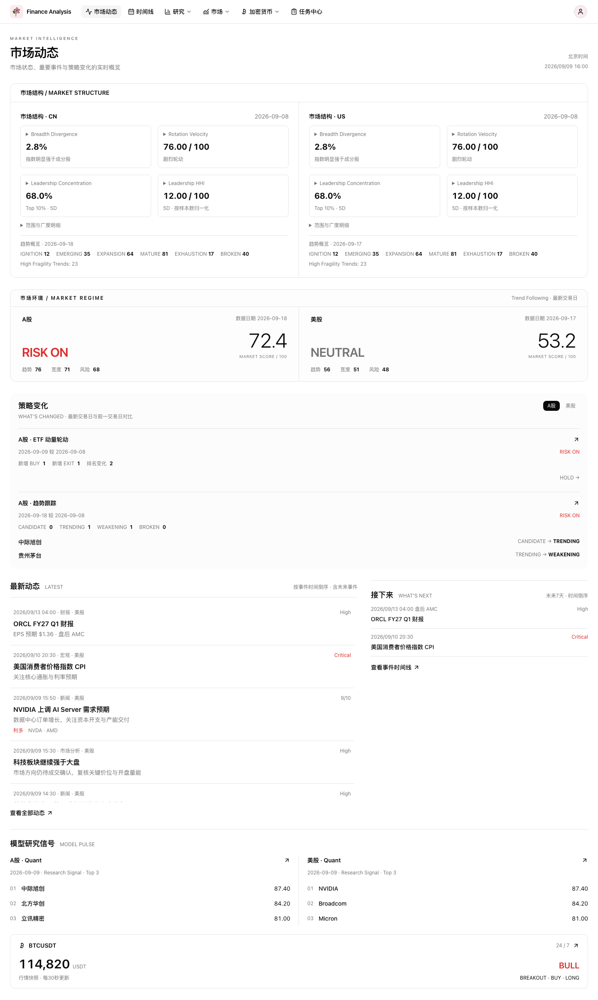
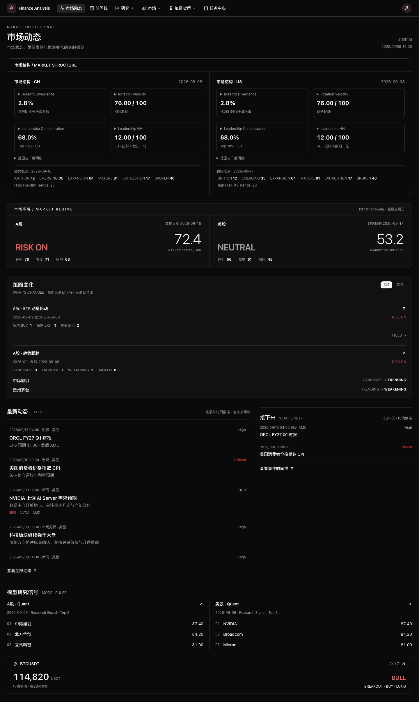

# 桌面市场动态首页

Web UI 仅面向桌面浏览器。根布局最低宽度 1200px，Shell 最大内容宽度 1500px；更窄窗口允许页面级横向滚动，不维护手机导航或替代表格。
`/` 和登录后的默认目标为 `/dashboard`；显式登录 redirect 仍有效。个股分析页面已移除。

## 模块顺序与数据来源

| 模块 | 现有公共来源 | 展示边界 |
| --- | --- | --- |
| 市场结构 / MARKET STRUCTURE | Market Structure `snapshot(CN/US)`、Trend ranking 的 lifecycle/fragility 摘要 | Header 后首先展示，沿用现有结构计算 |
| 市场环境 / MARKET REGIME | Trend `ranking(CN/US)` | 复用策略变化的同一请求；marketRegime、0–100 marketScore（不乘100）、趋势/宽度/风险 breakdown、实际 tradeDate；不展示风险敞口 |
| What's Changed | ETF / Trend `ranking(CN/US).changes` | 本地市场切换；显示实际对比交易日；重点变化，普通 WATCH 不展示 |
| Latest / What's Next | Timeline `list({limit:10})` / `category=event, end_date=today+7, limit=100` | 同行展示；Latest 无 cutoff，含未来事件；Next 最多8条未发生的 earnings/macro；均保留 API 倒序 |
| Model Pulse | Quant `signals(CN/US)`、BTC `overview()` | 页面最后展示模型研究信号 Top 3；BTC 价格/Regime/Setup/Action/State，每30秒刷新公开快照 |

首页不再请求 Quant `marketRegime()`，Quant 独立页面和 API 保持不变；不新增 Dashboard 聚合 API。
TODO：后续评估行业强度轻量摘要；目前只有完整排行与详情组件，本次不增加首页模块或复制算法。

每个来源拥有独立 loading/error/retry 状态。时区变化重新获取 Timeline cutoff，异步请求使用版本号防止旧响应覆盖新结果。
页面不读取持仓、投资组合、自选股、分析历史或用户偏好接口；时区仍复用全站展示时区。
数据不足时显示缺失状态，不推导市场评分增量、BTC涨跌幅或缺失的策略比较结果。

## 桌面清理与信息层级

- 删除 Shell 手机菜单、Tasks / WatchList / StockList / Quant 的 Mobile Card 双模板。
- 删除手机图表字号分支、手机弹层 CSS 和对应窄屏测试。
- 保留不同桌面宽度的 `xl` / `2xl` 栅格，以及有必要的表格内部滚动。
- ETF Ranking 为 11 列；完整收益、Entry 和各因子指标在 Detail Dialog。
- Trend Ranking 为 11 列，名称/代码合并，移除完整 Reasons 和高级指标列；排序指标选择仍覆盖原字段。
- Trend Portfolio 为 9 列：股票、State、Action、Units、当前仓位、入场价、当前价、跟踪止损、下一动作。
- Timeline 按日期分组，桌面 3 列、`2xl`（1536px）起 4 列 CSS Columns 瀑布流；公共、无 uid/Notes、DESC、end_date cutoff 和 cursor 语义不变。

## 视觉验证

以下是固定公开 fixture 数据的 1440px 截图，不代表实时市场事实。

验证覆盖 1280 / 1440 / 1920px 深浅色、登录默认路由、公共请求白名单、局部失败重试、Timeline 原始顺序及详情链接。
真实登录依赖的 smoke 用例仍需要 `FA_WEB_SMOKE_PASSWORD`；没有凭据时按原规则跳过。

后续可单独评估：公开排名接口在首页只显示摘要但仍返回全量数据的成本，以及更细的快照新鲜度提示。首版不新增聚合 API。
